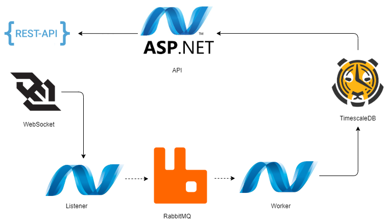

# interview-timeseries

An example application built with .NET and [TimescaleDB](https://www.timescale.com/).

This application processes and stores metric events emitted via websocket and exposes a simple JSON API to explore the data. 

## Architecture


This app consists of two services: `api` and `listener`. 

`api` is an ASP.NET Web API intended to view the stored metrics.

`listener` is a worker service which listens to websocket events in background and writes data to a TimescaleDB.

## How to run

### Using Docker

- Clone this repository
- Run the project using [docker-compose](docker-compose.yml):
```bash
docker-compose -f .\docker-compose.yml up --build -d
```
- docker-compose will create three containers: ```api```, ```listener``` and ```timescaledb```. Database uses the default  credentials (```timescaledb password```).

Access the SwaggerUI via following URLs:
- [Swagger](http://localhost:8000/swagger/index.html) - http://localhost:8000/swagger/index.html

### Running in VSCode

- Clone this repository

- Start the TimescaleDB separately using docker-compose:
```bash
docker-compose -f .\docker-compose.yml up --build -d timescaledb
```

- If you wish to use a different database, update connection strings for TimescaleDB to point to your local database server in [api ```appsettings.Development.json```](src\api\TimeSeriesStorage.Api\appsettings.Development.json) and [listener ```appsettings.Development.json```](src\api\TimeSeriesStorage.Api\appsettings.Development.json)
```json
"ConnectionStrings": {
    "TimescaleDB": "host=localhost;port=9000;User ID=timescaledb;Password=password;Database=timeseriesstorage;"
  }
```
- Database migrations would run on the first startup. 

- Run either ```api```, ```listener``` or both using configurations in 
[launch.json](.vscode\launch.json)

Access the app via following URL:
- [Swagger](https://localhost:7055/swagger/index.html) - https://localhost:7055/swagger/index.html

### Running in other IDEs

- Do the same steps as explained for VSCode
- Configure your projects to run using ```Development``` environment

## Future proposals



To scale this application for production, I propose following: 
- Split `listener` into two separate services: `listener` and `worker`
- `listener` would still handle the websocket connection, while `worker` would be responsible for saving the data to TimescaleDB.
- Connect the services via a message queue, e.g. RabbitMQ
- Batch / bufferize incoming requests in the `listener` side.
